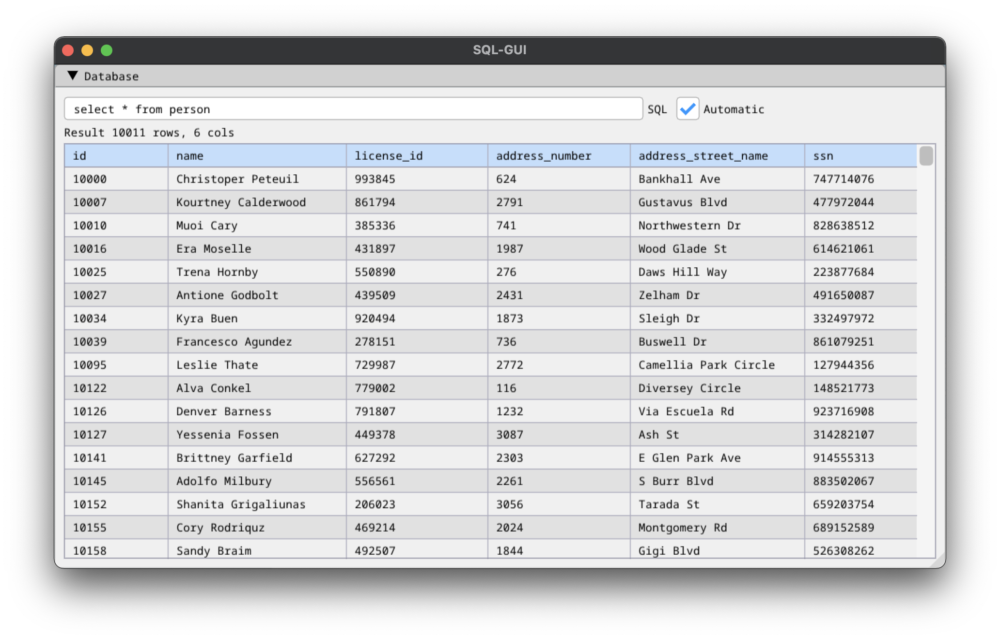

# SQL-GUI - a SQLite database query tool

## Building

	% make

## Running

	% ./sql-gui [database] [sql]

You can use the included sample database like this:

	% ./sql-gui sql-murder-mystery.db "select * from person"

## Thanks

Made with the excellent [Dear ImGui](https://github.com/ocornut/imgui), and [SQLite](https://www.sqlite.org/). The sample database is from the amazing [SQL Murder Mystery](https://github.com/NUKnightLab/sql-mysteries).

