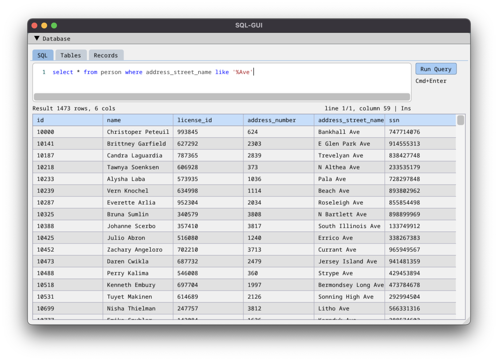
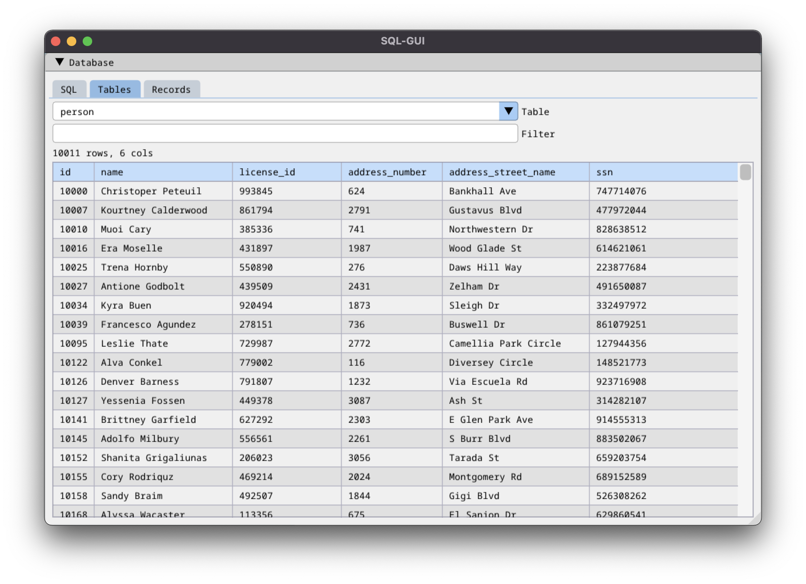
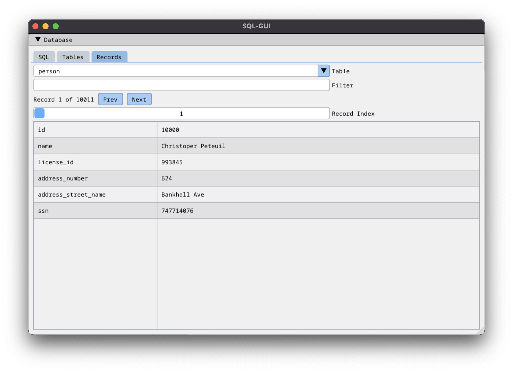

# SQL-GUI - a SQLite database query tool

This simple tool allows you to query, browse, and modify SQLite databases.

# Features

You can enter SQL queries and see the results in a table.

You can browse each table in the database, optionally filtering the results.

You can browse individual records within each table.

> **Note:** if you modify your SQLite database, for example via `insert`, `update`, or `delete` statements, then the results are *saved to the database immediately.*
> **There is no undo or rollback.**
> If you use only `select` statements, or the browser tabs (Tables and Records) then your database will not be modified.

## Building

	% make

## Running

	% ./sql-gui [database] [sql]

You can use the included sample database like this:

	% ./sql-gui sql-murder-mystery.db "select * from person"

If no database is specified, then an empty database is created in memory. You can create tables and records via the SQL input area, but there is no feature to save the database to disk.

If no SQL is specified on the command line, a default query is displayed.

## Thanks

Made with the excellent [Dear ImGui](https://github.com/ocornut/imgui) (MIT License), and [SQLite](https://www.sqlite.org/) (Public Domain). The sample database is from the amazing [SQL Murder Mystery](https://github.com/NUKnightLab/sql-mysteries) (MIT License).

